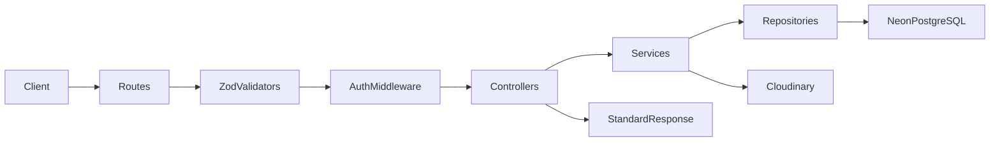

# Architecture

## Purpose

Defines the layered architecture of the Blog CMS backend API, enforcing separation of concerns and scalability.

## Responsibilities

- Route HTTP requests through validation, auth, controllers, services, and repositories
- Keep business logic out of controllers and routes
- Isolate PostgreSQL access in the repository layer via Drizzle ORM
- Provide a consistent API response format

## Request Flow

## Best Practices

- Controllers only orchestrate — no business rules
- Services handle validation of business rules (slug uniqueness, publish logic)
- Repositories execute Drizzle queries only
- Use `asyncHandler` for all async route handlers

## Future Scalability

- Extract modules into bounded contexts (auth, blog, media)
- Add read replicas or connection pooling for high traffic
- Introduce caching layer (Redis) between services and repositories
