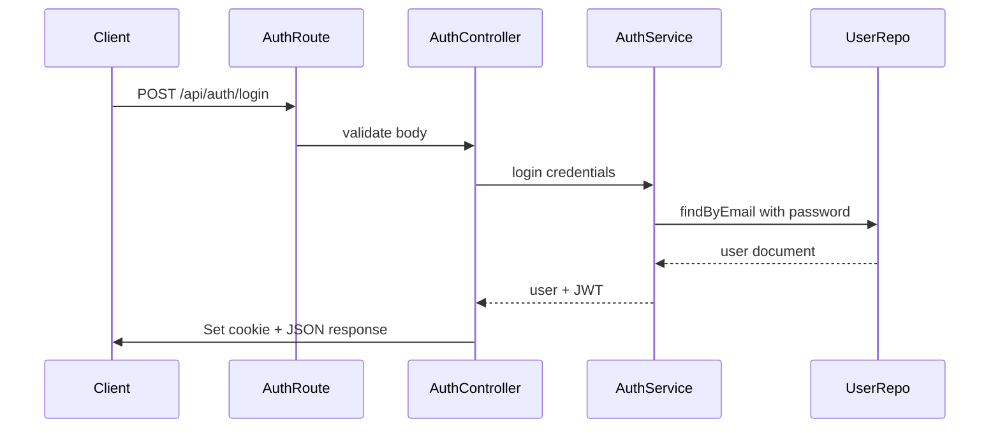

# Authentication

## Purpose

Handles user registration, login, logout, and session retrieval via JWT stored in HttpOnly cookies.

## Responsibilities

- Hash passwords with bcrypt on registration
- Issue JWT on successful login/register
- Set and clear signed HttpOnly cookies
- Expose current user via `/api/auth/me`

## Request Flow

## Components Involved

- `routes/auth.routes.ts`
- `controllers/auth.controller.ts`
- `services/auth.service.ts`
- `repositories/user.repository.ts`
- `models/user.model.ts`
- `validators/auth.validator.ts`

## Best Practices

- Never return password hash in API responses
- Use signed cookies with `COOKIE_SECRET`
- Set `secure: true` in production

## Future Scalability

- Email verification on register
- Refresh token rotation
- OAuth providers (Google, GitHub)
- Password reset flow
