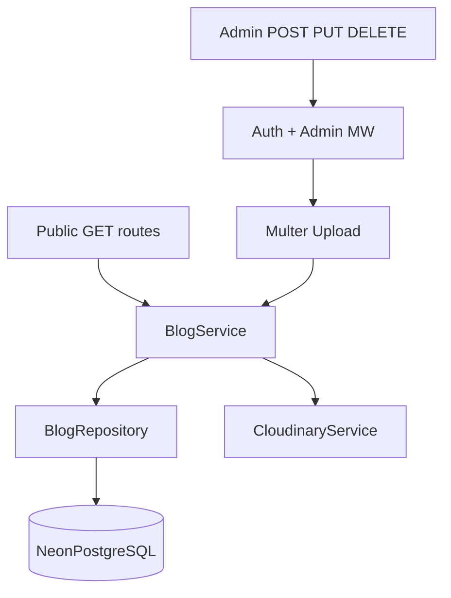

# Blog Module

## Purpose

End-to-end documentation of the blog domain — CRUD, public APIs, and dashboard features.

## Request Flow

## Components Involved

- `src/db/schema.ts` — blogs table definition
- `repositories/blog.repository.ts`
- `services/blog.service.ts`
- `controllers/blog.controller.ts`
- `utils/blog-mapper.util.ts`

## Best Practices

- Static routes (`/latest`, `/featured`) registered before `/:slug`
- Cover images stored as URL + publicId columns in PostgreSQL
- UUID primary keys exposed as `id` in API responses
